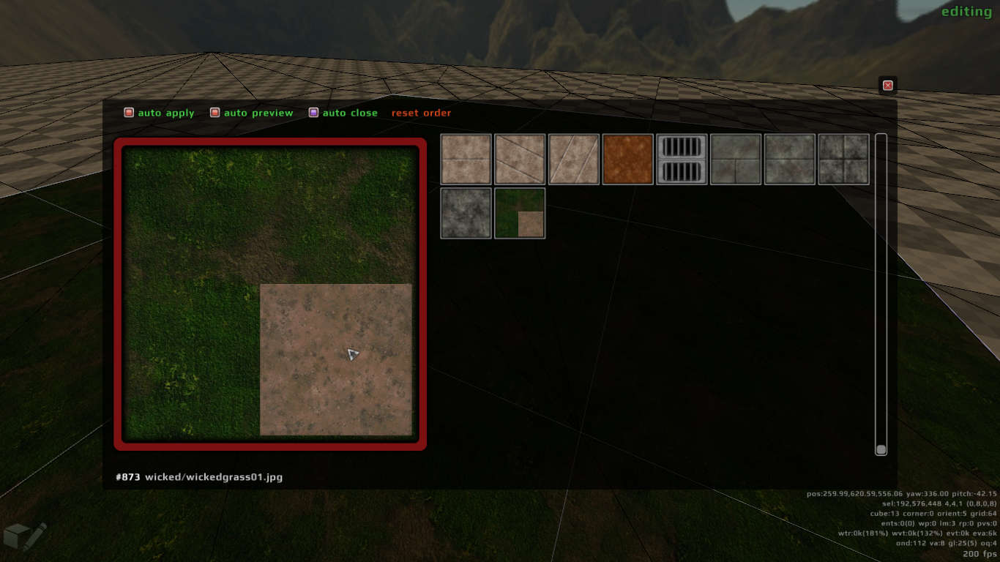
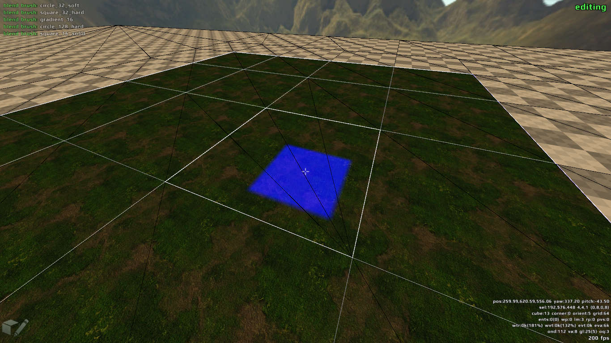
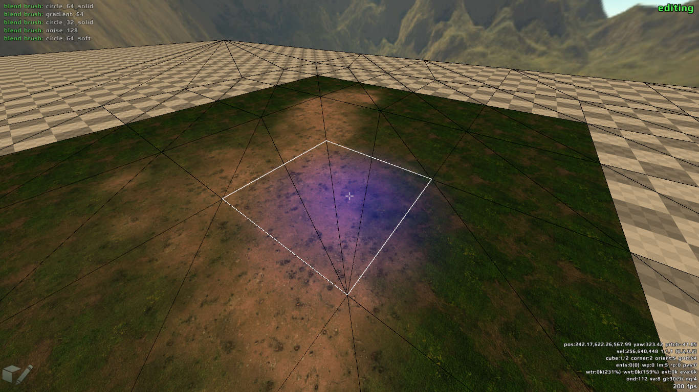

# Blendmapping

A blendmap allows you to combine textures by overlapping them with a brush. This lets you create seamless environments where grass meets mud, or where gravel meets rock. Using this technique in a map can add a more natural feel to the environment.

The blendmap is pre-baked when calculating the lightmap and is stored within the map file itself. The following will show you how to create your very own blendmap.

## Create a layered texture

 The first thing to do is create a layered texture. Within the editor, find the texture slot of a texture (can be viewed at the bottom left of the texture browser) and apply it to a surface texture using the **vlayer** command.

For example, after selecting a textured surface:

`/vlayer 331`

### Advanced Method

You can add texture layers with the **texlayer** command in a map config, for example:

`setshader bumpspecmapparallaxworld`
`texture c "wicked/wickedmoss01.jpg" 0 0 0 0.250000`
`texture n "wicked/wickedmoss01n.jpg"`
`texture z "wicked/wickedmoss01z.jpg"`
`texture s "wicked/wickedmoss01s.jpg"`
`texlayer 331`

## Painting with the blendbrush

 Now that we have a layered texture, we are ready to start painting. Enable the blendbrush by pressing **P**. You can press **P** several times for different methods of applying the brush, such as erasing the blendmap or merging the blendmap. Scrolling the mouse wheel will enable you to change the brush shape and density.

**Brush modes:**

-   **1:** Blends both textures, but will overwrite existing blendmapping around the brush area (a square).
-   **2:** Blends textures, adding to the existing blendmap in place. **This is the most common setting.**
-   **3:** Totally blanks blendmap around the brush area (full erase).
-   **4:** Similar to \#1, except inverted: defaults to vlayer texture and paints base texture over it.
-   **5:** Similar to \#2, except removes the vlayer according to the brush, functioning as an eraser.

You'll want to first create a lightmap so we can actually see the blendmap, we'll need at least one light for this.

`/skylight 150 130 110`
`/calclight`

 Now that we have a lightmap, we can draw with our brush onto the layered texture. Simply click on the texture with the brush painting mode activated. Choosing "*blend mode: merge*" will allow you to paint the layered texture on top of the base texture.

To exit the blendmap painting mode, press **P** until you see "*blend mode: off*" in the console.

Take note that every time you change the geometry in a map, your blendmap will start looking broken. In order to fix it after a geometry change, you want to re-run **calclight**, as the blendmap works similar to lightmaps (it is pre-rendered).

## Clearing the blendmap

The blendmap can be removed/reset with:

`/clearblendmap`

## Custom brushes

The default brushes are stored in *data/blendbrush*. To add custom brushes, you will want to add them to *blendbrush/* in your [User Content](Game_Settings#Location "wikilink") directory. A blendbrush can easily be created with any greyscale image. The darker parts are drawn more densely than lighter parts. 

## Tips & Ideas

-   You can only paint on horizontal surfaces with the blendbrush in painting mode. In can be very tricky to paint on a vertical surface (such as a wall).
-   Stacked floors cannot have their own blendmap layer. For example, picture a block of apartments where each floor has a layered texture, the blendmap applied on one floor will appear on every floor where a layered texture is present.
-   The blendmap can be combined with [grass](grass "wikilink") rendering to create some awesome texture effects.
-   Blendmaps created with custom brushes can be viewed by other players even if they don't have the blendbrushes present in their User Content direcotry. The blendmap is stored within the mapfile as a pre-rendered image.

