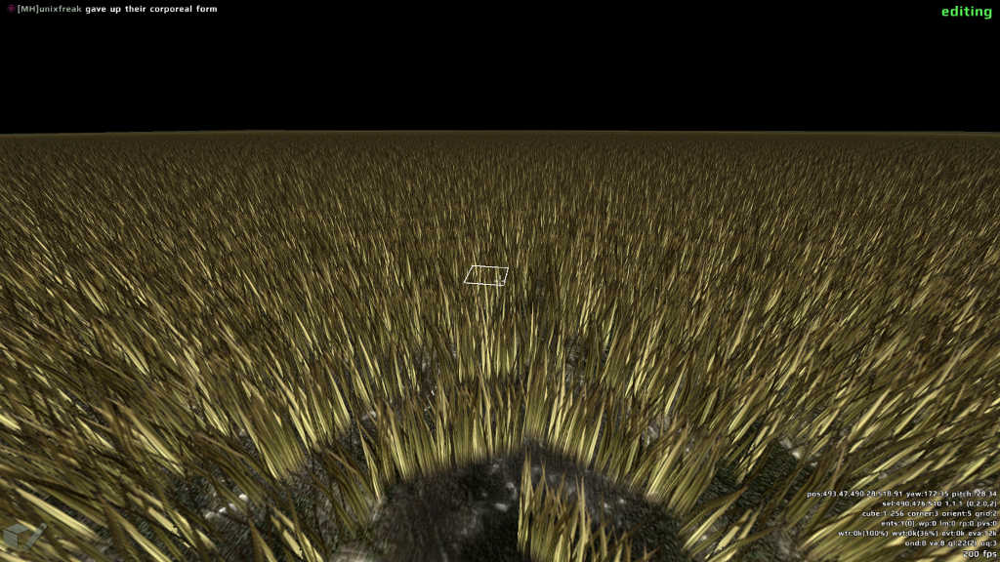

# Enabling Grass

First, you want to make sure you can actually see grass. To do this, enable grass in the graphics options or type this at the console:

`/grass 1`

Take note that it may drop your framerate slightly depending on how much grass is visible in the current view. You may want to lower (or increase) the distance as to which grass is rendered by using the **grassdist** setting.

`/grassdist 128`

# Adding grass to a map

To add grass to a map, select a texture surface in the editor, and use the command **setgrass** followed by the path to a grass texture.

`/setgrass textures/grass.png`

Applying grass to a random texture might look strange, so look for a fitting texture that the grass will be growing out of. For example we might use, *wicked/wickedmoss01.png* because it blends nicely with the colours of *textures/grass.png*.

You will now see grass growing from the chosen texture.

## Advanced Method

Add the command **texgrass** to a texture slot. To do this, open up your maps config in a text editor and apply this example to the end of a texture slot:

`texgrass "`<agrad:0,0.2>`textures/grass.png" `

The <b>agrad</b> flag takes two values as an argument, this is a range for controlling the alpha gradient of the grass texture. A good starting value is *0,0.2*, try tweaking it, the higher the value -- the more transparent the alpha gradient becomes.

Add this example to the map config:

`setshader bumpspecmapparallaxworld`
`texture c "wicked/wickedmoss01.jpg" 0 0 0 0.250000`
`texture n "wicked/wickedmoss01n.jpg"`
`texture z "wicked/wickedmoss01z.jpg"`
`texture s "wicked/wickedmoss01s.jpg"`
`texgrass "`<agrad:0,0.2>`textures/grass.png"`

Find the new texture slot in the texture browser and apply it to a cube surface.

# Modifying the grass

There are several things you can do to change the grass and how it appears in your map including the way it moves.

## Appearance

grasscolour  
sets the color of grass as RGB values (ex. /grasscolour 100 255 100)

grassheight  
sets the height of grass

grassblend  
sets the transparency of grass

grassscale  
how big the grass will be

## Animation

grassanimmillis  
the delay at which the grass sways back and forth

grassanimscale  
the higher the value, the higher the grass will sway

## Available Textures

Currently (as of svn 6942) there are 9 grass textures available.

-   [textures/grass.png](https://raw.githubusercontent.com/red-eclipse/data/master/textures/grass.png)

Nobiax

-   [nobiax/grass01.png](https://raw.githubusercontent.com/red-eclipse/data/master/nobiax/grass01.png)
-   [nobiax/grass02.png](https://raw.githubusercontent.com/red-eclipse/data/master/nobiax/grass02.png)
-   [nobiax/grass03.png](https://raw.githubusercontent.com/red-eclipse/data/master/nobiax/grass03.png)
-   [nobiax/grassbush.png](https://raw.githubusercontent.com/red-eclipse/data/master/nobiax/grassbush.png)

Luckystrike

-   [luckystrike/grass\_lucky.png](https://raw.githubusercontent.com/red-eclipse/data/master/luckystrike/grass_lucky.png)
-   [luckystrike/grass\_lucky\_alt.png](https://raw.githubusercontent.com/red-eclipse/data/master/luckystrike/grass_lucky_alt.png)
-   [luckystrike/grass\_lucky\_bright.png](https://raw.githubusercontent.com/red-eclipse/data/master/luckystrike//grass_lucky_bright.png)
-   [luckystrike/grass\_lucky\_green.png](https://raw.githubusercontent.com/red-eclipse/data/master/luckystrike/grass_lucky_green.png)

# Tips & Ideas

-   A [blendmap](blendmap "wikilink") can be used to draw grass with a brush.
-   Who says that a grass texture needs to be grass?
-   Try not to make grass the dominant feature of a map, remember that some players will have the setting turned off.
-   Using a surface texture with similar colours to the grass texture will make the grass appear more dense.
-   Use grass sparingly, a large open field full of grass will impact performance more greatly than a patch of grass.
-   Only one type of grass can be used per map.

